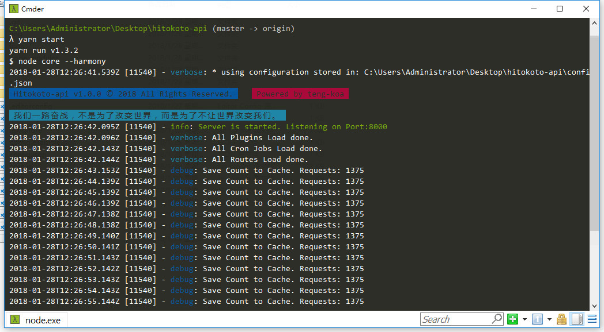

# Hitokoto API


  
[](https://travis-ci.org/github/hitokoto-osc/hitokoto-api) [](https://deepscan.io/dashboard#view=project&tid=9730&pid=12316&bid=188710) [](https://codeclimate.com/github/hitokoto-osc/hitokoto-api)  
本项目是基于 Teng-koa 实现的一言接口程序。相较于单纯的一言程序，此框架提供了扩展性。

以下是相对于 v0 （PHP 版本）新加入的功能：

* 请求统计
* 支持返回 JS 回调函数
* 支持 length 区间返回
* 返回 JS 的支持
* 支持 GBK 编码
* 开源数据集
* A/B 无感知更新数据
* 官方扩展
  * 网易云音乐

我们一直致力于框架的可维护性与可扩展性，这也是为什么我们选择下一版本（v2）将使用 Go 编写。
由于历史问题，此框架存在着很多不足（需要重构）的地方，我们将分 2 个大版本完全重构掉这些问题（基于 Alinode, DeepScan, CodeClimate 分析结果)

> 关于贡献
> 您可以关注我们的开发者文档，我们在其中简单介绍了本框架的基本运作机理，这将会使你为此框架开发扩展异常容易（比如：加一个 QQ 音乐接口）

## 外部依赖

* Redis
  
## 日记

日记默认保存在 `./data/logs/Hitokoto-api.log`

## 开始使用

### 常规使用

首先配置好 Node.js 环境（>=12.x)，以及 `yarn`。

1. 克隆仓库 `git clone https://github.com/hitokoto-osc/hitokoto-api.git your_workdir`
2. 进入仓库 `cd your_workdir`
3. 安装依赖 `yarn`
4. 复制配置 `cp config.example.json ./data/config.json`，根据需要对其进行配置。
5. 启动程序 `yarn start`

### 容器使用

* 常规使用（需要预先安装好 redis），由于使用共享网络，请留意 8000 端口是否被占用。

```shell
docker run \
-v /path/to/your/data/dir:/usr/src/app/data \
--network host \
hitokoto/api
```

其他高深玩法（比如说不共享网络），还请自己摸索。

* 我们提供 docker-compose 配置（提供 redis 依赖），有需要的可以自行下载使用。
